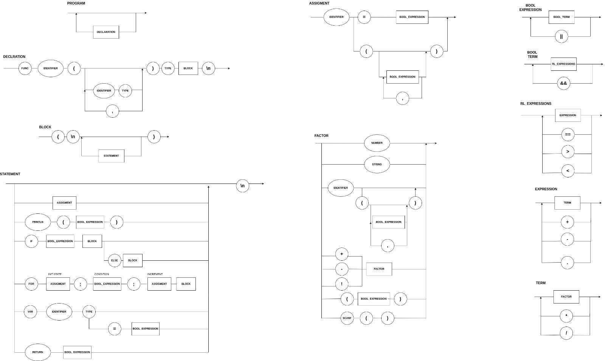

# Status dos testes


### EBNF

```py
PROGRAM         = {STATEMENT};
BLOCK           = "{", "\n", { STATEMENT }, "}";
STATEMENT       = (λ | ASSIGN | PRINT | IF | FOR | VAR), "\n";
ASSIGN          = IDENTIFIER, "=", BOOLEXPRESSION;
PRINT           = "Println", "(", BOOLEXPRESSION, ")";
IF              = "if", BOOLEXPRESSION, BLOCK, {"else", BLOCK};
FOR             = "for", ASSIGN, ";", BOOLEXPRESSION, ";", ASSIGN, BLOCK;
VAR             = "var", IDENTIFIER, ("int" | "string"), (λ | "=", BOOLEXPRESSION);
BOOLEXPRESSION  = BOOLTERM, {"||" BOOLTERM};
BOOLTERM        = RELEXPRESSION, {"&&", RELEXPRESSION};
RELEXPRESSION   = EXPRESSION, {("==" | ">" | "<"), EXPRESSION};
EXPRESSION      = TERM, { ("+" | "-" | "." ), TERM};
TERM            = FACTOR, {("*" | "/"), FACTOR};
FACTOR          = INT | STRING | IDENTIFIER | (("+" | "-" | "!"), FACTOR) | "(", BOOLEXPRESSION, ")" | SCAN;
SCAN            = "Scanln", "(", ")";
IDENTIFIER      = LETTER, {LETTER | DIGIT | "_"};
INT             = DIGIT, {DIGIT};
STRING          = ( " | ' ), { λ | LETTER | DIGIT }, ( " | ' );
LETTER          = ( a | ... | z | A | ... | Z );
DIGIT           = ( 1 | 2 | 3 | 4 | 5 | 6 | 7 | 8 | 9 | 0 );
```

### Diagrama Sintático 

