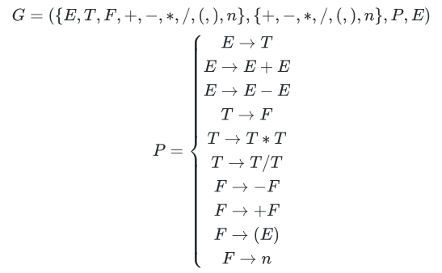
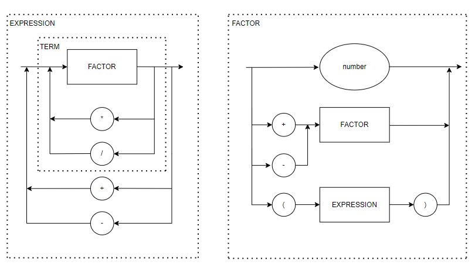

# Status dos testes


### EBNF

```py
EXPRESSION = TERM, { ("+" | "-"), TERM } ;
TERM = FACTOR, { ("*" | "/"), FACTOR } ;
FACTOR = ("+" | "-") FACTOR | "(" EXPRESSION ")" | number ;
```

### Grámatica



### Diagrama Sintático


